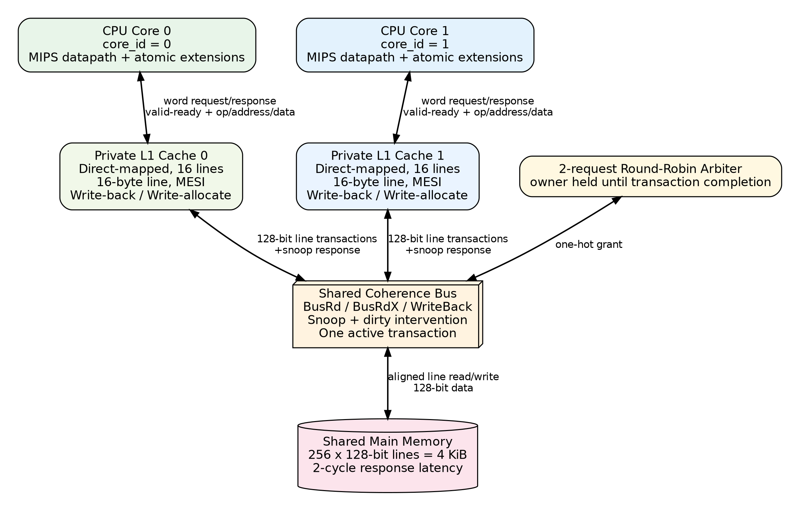
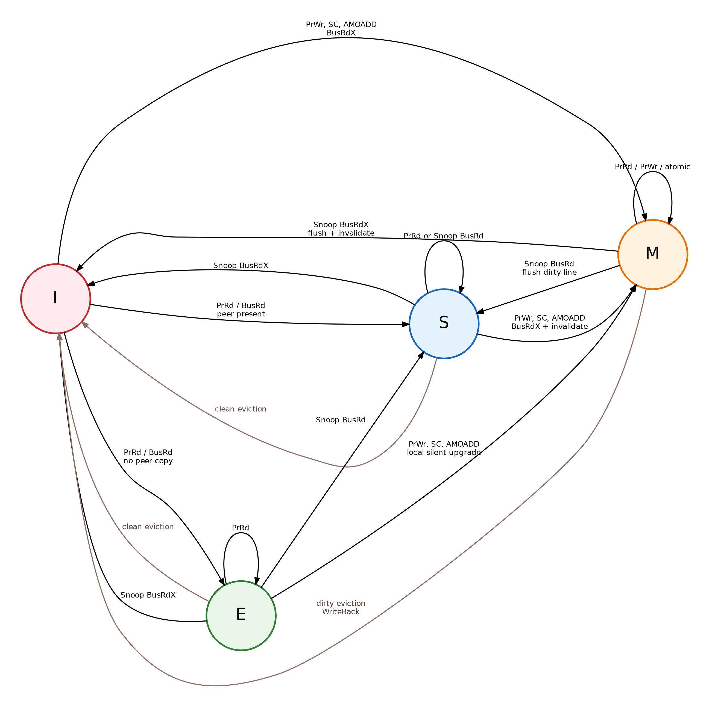

<div align="center">

# Dual-Core CPU with MESI Cache Coherence

### پردازنده دوهسته‌ای با حافظه‌های نهان خصوصی، گذرگاه مشترک و دستورات اتمی

[](#)
[](#)
[](#)
[](#testing-and-validation)

An educational RTL dual-core processor system featuring private write-back L1 caches, a snooping shared bus, MESI coherence, round-robin arbitration, shared memory, and atomic synchronization instructions.

**Team:** Ehsan · Arad · Shahab

[Features](#features) • [Architecture](#architecture) • [Atomic Instructions](#atomic-instructions) • [Run Tests](#quick-start) • [Results](#final-validated-results) • [Report](#documentation)

</div>

---

## Overview

This project extends a single-core educational processor into a coherent **dual-core system**. Each CPU owns a private direct-mapped L1 data cache, while both cores communicate through a shared snooping bus and a common main memory.

The main challenge is preserving a consistent view of shared data when both cores read and modify the same cache line. The implementation solves this problem using the **MESI protocol** and supports lock-free synchronization through `lr.w`, `sc.w`, and `amoadd.w`.

> The processor datapath is based on the original MIPS-style educational core, while the newly added atomic instruction behavior follows the required RV32-style semantics.

## Architecture

<p align="center">
  
</p>

```text
┌──────────────┐     ┌──────────────────┐
│  CPU Core 0  │────▶│ Private L1 MESI │──┐
└──────────────┘     └──────────────────┘  │
                                            │
                                            ▼
                                  ┌──────────────────┐
                                  │ Snooping Shared │
                                  │ Bus + RR Arbiter│
                                  └──────────────────┘
                                            │
                                            ▼
                                  ┌──────────────────┐
                                  │  Shared Memory   │
                                  └──────────────────┘
                                            ▲
                                            │
┌──────────────┐     ┌──────────────────┐  │
│  CPU Core 1  │────▶│ Private L1 MESI │──┘
└──────────────┘     └──────────────────┘
```

### Main configuration

| Component | Configuration |
|---|---|
| CPU cores | 2 |
| Address/data width | 32 bits |
| Private L1 caches | 2, one per core |
| Cache organization | Direct-mapped, 16 lines |
| Cache-line size | 16 bytes / 128 bits / 4 words |
| Capacity per L1 | 256 bytes |
| Write policy | Write-back, write-allocate |
| Coherence protocol | MESI |
| Bus transactions | `BusRd`, `BusRdX`, `WriteBack` |
| Arbitration | Two-requester round-robin |
| Shared memory | 256 × 128-bit lines = 4 KiB |
| Default memory latency | 2 cycles |

## Features

### MESI cache coherence

Each cache line is tracked in one of four stable states:

| State | Meaning |
|---|---|
| **M — Modified** | The cache owns the only valid copy, and memory is stale. |
| **E — Exclusive** | The cache owns the only valid clean copy. |
| **S — Shared** | One or both caches may hold a clean copy. |
| **I — Invalid** | The line is not valid in this cache. |

Implemented coherence behavior includes:

- Local load/store hits and misses
- `BusRd` for shared reads
- `BusRdX` for ownership acquisition and invalidation
- Silent `E → M` upgrades on local writes
- `S → M` upgrades through `BusRdX`
- Dirty cache-to-cache intervention
- Full 128-bit dirty-line write-back
- Modified-line eviction handling
- Peer invalidation on remote writes
- Stable transaction ownership until the final response
- Error routing only to the requesting core

<p align="center">
  
</p>

### Shared bus and arbitration

The shared interconnect performs the following sequence:

1. A round-robin arbiter selects one requester.
2. The bus records the owner, line address, transaction type, and write-back data.
3. `BusRd` and `BusRdX` snoop only the non-owner cache.
4. If the peer owns dirty data, the bus waits for valid 128-bit snoop data.
5. Dirty data is written back and forwarded to the requester.
6. A single final response is routed only to the original owner.

A `WriteBack` transaction bypasses snooping and writes the captured victim line directly to shared memory.

### Processor memory handshake

Memory operations use a request/response handshake:

```text
request:  valid + ready + address + operation + write data
response: valid + read data / atomic status + error
```

The CPU stalls while a request is pending. The program counter and destination state remain stable until the cache returns the final response.

## Atomic Instructions

The processor includes the following extensions:

| Instruction | Behavior |
|---|---|
| `cpuid rd` | Writes the current hardware core ID, `0` or `1`, into `rd`. |
| `lr.w rd, (rs1)` | Loads a 32-bit word and creates a reservation for that address. |
| `sc.w rd, rs2, (rs1)` | Stores only if the reservation is still valid; returns `0` on success and `1` on failure. |
| `amoadd.w rd, rs2, (rs1)` | Atomically returns the old word and stores `old + rs2`. |

### Reservation correctness

Each core maintains a reservation address and valid bit. A conflicting remote write invalidates the reservation. The implementation also guarantees that a failed `sc.w` does **not** modify memory or cache data.

```text
LR.W  → read value + create reservation
SC.W  → verify reservation at commit point
       ├─ valid:   perform write, return 0
       └─ invalid: no write, return 1
```

Atomic writes acquire exclusive ownership before committing. A line in `S` therefore issues `BusRdX`, invalidates peer copies, and transitions to `M`.

## Project Structure

```text
.
├── rtl/
│   ├── bus/
│   │   ├── rr_arbiter.sv
│   │   └── shared_bus.sv
│   ├── cache/
│   │   └── l1_cache_mesi.sv
│   ├── common/
│   │   └── mc_defs.svh
│   ├── core/
│   │   ├── cpu_core.v
│   │   └── cpu_control.v
│   ├── memory/
│   │   └── shared_memory.sv
│   └── top/
│       ├── multicore_interconnect_top.sv
│       └── dual_core_top.sv
├── tb/
│   ├── unit/
│   ├── integration/
│   └── mocks/
├── scripts/
│   └── test.sh
├── docs/
│   ├── interfaces.md
│   ├── team_handoff.md
│   └── report/
│       ├── final_report_fa.md
│       ├── final_report_fa.pdf
│       └── assets/
└── Hw6/                     # Frozen original baseline
```

## Quick Start

### Requirements

- Linux or WSL
- Bash
- Icarus Verilog with SystemVerilog support
- GTKWave, optional for waveform inspection

On Ubuntu/WSL:

```bash
sudo apt update
sudo apt install iverilog gtkwave
```

### Run the full regression

```bash
chmod +x scripts/test.sh
./scripts/test.sh all
```

A successful run ends with:

```text
PASS: tb_dual_core_top
TEST_EXIT=0
```

To preserve the exit code while saving the output:

```bash
set -o pipefail
./scripts/test.sh all 2>&1 | tee final_regression.log
echo "TEST_EXIT=${PIPESTATUS[0]}"
```

### Run individual targets

```bash
./scripts/test.sh cpu_baseline
./scripts/test.sh cpu_atomic_unit
./scripts/test.sh l1_cache_mesi
./scripts/test.sh rr_arbiter
./scripts/test.sh shared_bus
./scripts/test.sh shared_memory
./scripts/test.sh bus_memory
./scripts/test.sh multicore_interconnect_top
./scripts/test.sh dual_core_top
```

The dual-core test generates:

```text
build/dual_core_top/waves.vcd
```

Open it with:

```bash
gtkwave build/dual_core_top/waves.vcd
```

## Testing and Validation

The regression suite contains self-checking unit and integration tests for:

- Original single-core baseline: **208 / 208 accepted checks**
- CPU/cache request-response handshake
- CPU atomic decode and architectural results
- L1 MESI hits, misses, write-back, invalidation, and atomic behavior
- Round-robin arbitration
- Shared-bus ownership, snooping, dirty intervention, and error routing
- Shared-memory timing and line accesses
- Bus-to-memory integration
- Full multicore interconnect
- End-to-end dual-core LR/SC spinlock execution

## Final Validated Results

The final self-checking spinlock test completed successfully:

```text
RESULT: cycles=122 counter=2 lock=0
RESULT: core0_sc_success=1 core0_sc_fail=0
RESULT: core1_sc_success=1 core1_sc_fail=1
RESULT: cache0 hit=1 miss=2 flush=3 invalidation=2 transitions=5
RESULT: cache1 hit=5 miss=4 flush=0 invalidation=2 transitions=7
PASS: tb_dual_core_top
```

### Interpretation

- Both cores entered the critical section exactly once.
- The shared counter reached the expected value of `2`.
- The lock was released and returned to `0`.
- Contention caused one real `sc.w` failure and retry.
- No increment was lost.
- All unit and integration tests passed.

### Aggregate cache statistics

| Metric | Cache 0 | Cache 1 | Total |
|---|---:|---:|---:|
| Hits | 1 | 5 | 6 |
| Misses | 2 | 4 | 6 |
| Flushes | 3 | 0 | 3 |
| Invalidations | 2 | 2 | 4 |
| MESI transitions | 5 | 7 | 12 |

The aggregate hit rate for this contention-heavy test is:

$$
\text{Hit Rate}
=\frac{N_{hit}}{N_{hit}+N_{miss}}
=\frac{6}{6+6}
=50\%
$$

This value belongs to the short synchronization workload and is not intended as a general-purpose performance benchmark.

## Documentation

- [Final Persian report — Markdown](docs/report/final_report_fa.md)
- [Final Persian report — PDF](docs/report/final_report_fa.pdf)
- [Interface contract](docs/interfaces.md)
- [Team handoff and integration notes](docs/team_handoff.md)
- [Original project specification](project_1_exact_text.md)

## Design Notes

- The original `Hw6/` directory is retained as a frozen baseline.
- Active implementation lives under `rtl/`, `tb/`, `scripts/`, and `docs/`.
- The design intentionally allows one outstanding local data request per CPU and one active shared-bus transaction at a time.
- Performance counters are workload-dependent and are used for validation and architectural analysis rather than hardware benchmarking.

## Team

| Member | Main contribution |
|---|---|
| **Ehsan** | CPU migration, memory handshake, interfaces, bus, arbitration, shared memory, top-level infrastructure, integration, final validation |
| **Arad** | Private L1 cache, MESI state machine, snooping, invalidation, dirty intervention |
| **Shahab** | `cpuid`, LR/SC, AMOADD, reservation behavior, atomic and synchronization tests |

---

<div align="center">

Built for a Computer Architecture course project — from a single core to a coherent dual-core system.

**MESI · Write-Back · Snooping · LR/SC · AMOADD · Round-Robin**

</div>
