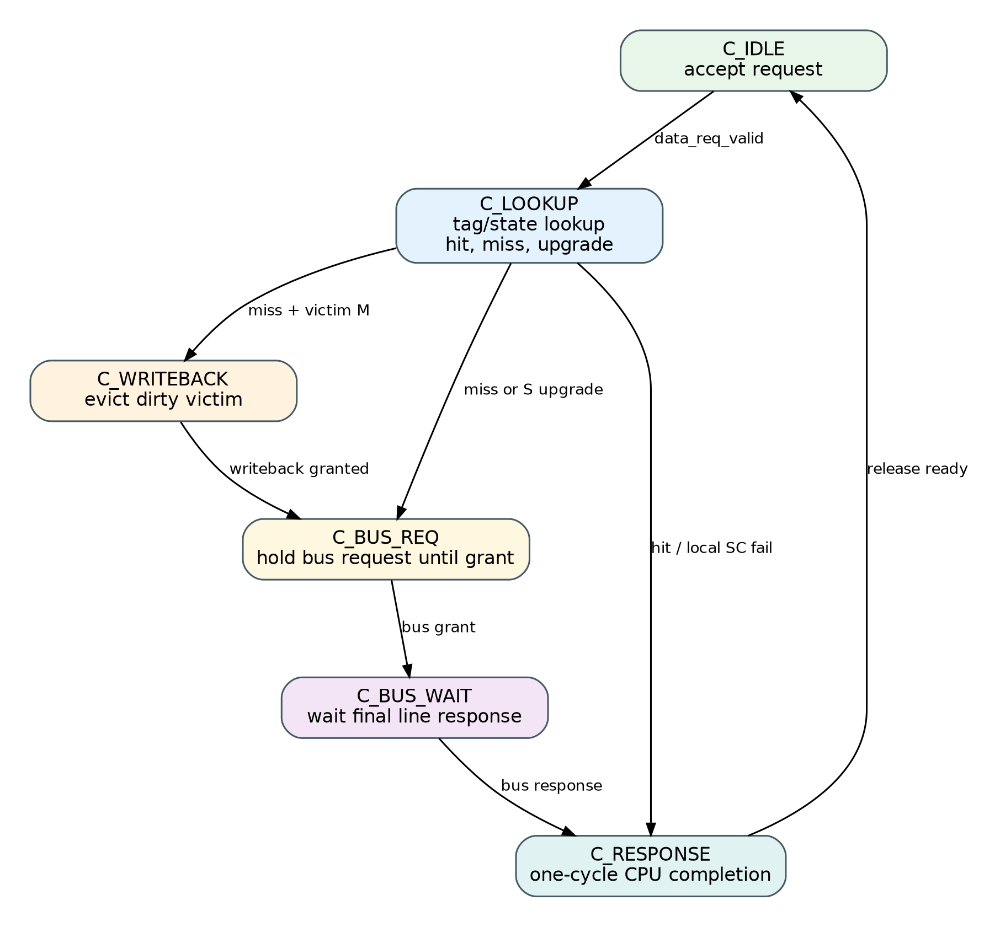
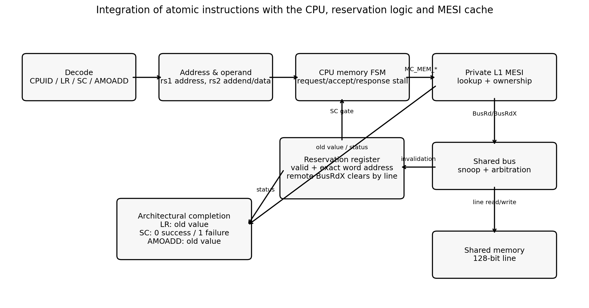
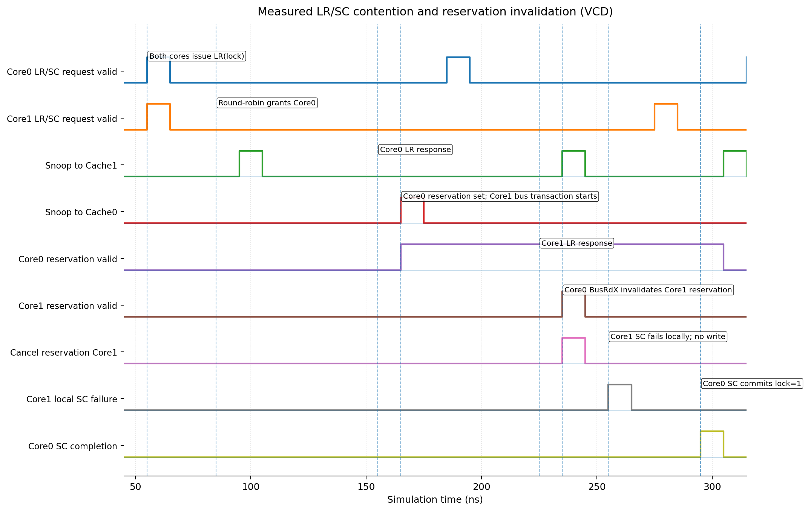
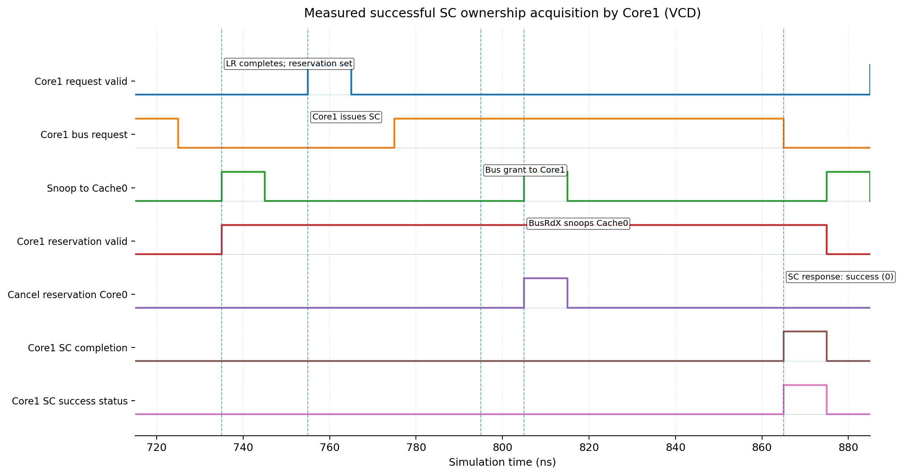
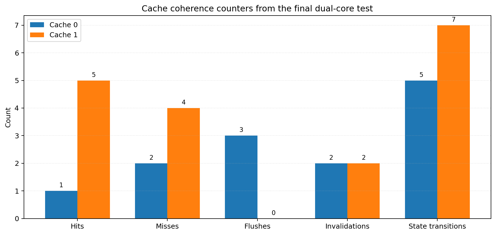

# گزارش نهایی پروژه ۱

## طراحی سامانه پردازشی چندهسته‌ای و پیاده‌سازی قرارداد انسجام حافظه MESI

**پردازنده دوهسته‌ای با حافظه‌های نهان خصوصی، گذرگاه مشترک و دستورات اتمی**

| مشخصات | مقدار |
|---|---|
| اعضای گروه | احسان، آراد، شهاب |
| نام درس | معماری کامپیوتر |
| نام استاد | ........................................ |
| شماره دانشجویی اعضا | ........................................ |
| نیم‌سال تحصیلی | ........................................ |
| مبنای گزارش | کد آزموده‌شده و خروجی شبیه‌سازی Icarus Verilog |

> این فایل به‌صورت Markdown استاندارد و قابل ویرایش تهیه شده است. فرمول‌ها با LaTeX نوشته شده‌اند و تصاویر با مسیر نسبی از پوشه `assets/` بارگذاری می‌شوند.

## چکیده

هدف این پروژه توسعه یک پردازنده تک‌هسته‌ای و تبدیل آن به یک سامانه دوهسته‌ای منسجم است. هر هسته دارای حافظه نهان داده سطح اول خصوصی است و هر دو هسته از طریق یک گذرگاه مشترک به حافظه اصلی دسترسی دارند. برای جلوگیری از مشاهده داده منقضی‌شده، قرارداد MESI با چهار حالت Modified، Exclusive، Shared و Invalid پیاده‌سازی شده است. حافظه نهان نگاشت مستقیم، دارای خط ۱۶ بایتی و سیاست Write-Back/Write-Allocate است. گذرگاه مشترک تراکنش‌های BusRd، BusRdX و WriteBack را پشتیبانی می‌کند و داوری بین دو هسته با روش Round-Robin انجام می‌شود.

مجموعه دستورات پردازنده نیز با دستور cpuid و عملیات اتمی lr.w، sc.w و amoadd.w توسعه یافت. هر هسته یک ثبات رزرو شامل آدرس کلمه و بیت اعتبار دارد. نوشتن هسته مقابل روی همان خط، رزرو را باطل می‌کند و باعث شکست sc.w بدون انجام نوشتن می‌شود. صحت سیستم با مجموعه‌ای از آزمون‌های واحد و یک برنامه Spinlock دوهسته‌ای خودارزیاب بررسی شد. در آزمون نهایی، هر دو هسته دقیقاً یک بار وارد ناحیه بحرانی شدند، شمارنده مشترک از صفر به ۲ رسید، قفل در پایان صفر شد و یک شکست واقعی sc.w و اجرای مجدد حلقه مشاهده گردید.

نتیجه شبیه‌سازی نهایی شامل ۱۲۲ سیکل اجرا، نرخ اصابت تجمیعی ۵۰ درصد، سه Flush، چهار Invalidation و دوازده انتقال ثبت‌شده در شمارنده‌های محلی حافظه‌های نهان است. تمام آزمون‌های واحد و یکپارچه با نتیجه PASS خاتمه یافته‌اند.

## فهرست مطالب

1. [مقدمه و اهداف پروژه](#۱-مقدمه-و-اهداف-پروژه)
2. [مشخصات فنی و معماری کلان](#۲-مشخصات-فنی-و-معماری-کلان)
3. [ساختار پردازنده و رابط حافظه](#۳-ساختار-پردازنده-و-رابط-حافظه)
4. [سازمان حافظه نهان L1](#۴-سازمان-حافظه-نهان-l1)
5. [قرارداد انسجام MESI](#۵-قرارداد-انسجام-mesi)
6. [گذرگاه مشترک، داور و حافظه اصلی](#۶-گذرگاه-مشترک-داور-و-حافظه-اصلی)
7. [توسعه مجموعه دستورات و عملیات اتمی](#۷-توسعه-مجموعه-دستورات-و-عملیات-اتمی)
8. [مدیریت رزرو و همگام‌سازی](#۸-مدیریت-رزرو-و-همگام‌سازی)
9. [روش آزمون و برنامه Spinlock](#۹-روش-آزمون-و-برنامه-spinlock)
10. [نمودارهای زمانی و جابه‌جایی مالکیت](#۱۰-نمودارهای-زمانی-و-جابه‌جایی-مالکیت)
11. [نتایج و تحلیل عملکرد](#۱۱-نتایج-و-تحلیل-عملکرد)
12. [جمع‌بندی](#۱۲-جمع‌بندی)
13. [پیوست‌ها](#پیوست-الف--دستور-اجرای-regression-نهایی)

## ۱. مقدمه و اهداف پروژه

سامانه‌های چندهسته‌ای برای افزایش توان پردازشی، چند هسته را به حافظه مشترک متصل می‌کنند. وجود حافظه نهان خصوصی در هر هسته، زمان دسترسی متوسط را کاهش می‌دهد؛ اما کپی‌های متعدد از یک آدرس مشترک می‌توانند ناسازگار شوند. مسئله اصلی پروژه، طراحی مسیر سخت‌افزاری‌ای است که هم کارایی حافظه نهان را حفظ کند و هم مشاهده داده منقضی‌شده را غیرممکن سازد.

مطابق تعریف پروژه، سامانه باید از دو هسته، دو حافظه نهان L1 خصوصی، حافظه اصلی مشترک، گذرگاه Snooping، قرارداد MESI، عملیات Flush و Invalidation، داوری Round-Robin و دستورات cpuid، lr.w، sc.w و amoadd.w تشکیل شود. همچنین باید صحت اجرای هم‌زمان روی متغیر مشترک و ناحیه بحرانی با برنامه آزمایشی و شبیه‌سازی نشان داده شود.

### ۱-۱. اهداف اجرایی
- ایجاد ساختار کامل دو CPU و دو حافظه نهان خصوصی با حافظه اصلی مشترک.
- پیاده‌سازی حالت‌ها و انتقال‌های MESI در پاسخ به درخواست محلی و Snooping.
- پشتیبانی از Write-Back، Write-Allocate، Dirty eviction و مداخله خط Modified.
- پشتیبانی از تشخیص شناسه هسته و عملیات اتمی با معنای معماری مشخص.
- ابطال رزرو در اثر نوشتن راه‌دور و تضمین شکست sc.w بدون نوشتن.
- اندازه‌گیری رفتار حافظه نهان و تحلیل تأخیر ناشی از رقابت روی گذرگاه.
- ایجاد Regression خودارزیاب برای واحدها و سامانه دوهسته‌ای.

## ۲. مشخصات فنی و معماری کلان


*شکل ۱ ـ معماری کلان سامانه دوهسته‌ای و مسیر اتصال حافظه‌های نهان به گذرگاه و حافظه مشترک*

در بالاترین سطح، ماژول dual_core_top دو نمونه cpu_core و دو نمونه l1_cache_mesi را به multicore_interconnect_top متصل می‌کند. Interconnect شامل یک shared_bus و یک shared_memory است و rr_arbiter درون گذرگاه قرار دارد. هر هسته تنها یک درخواست داده معلق دارد و گذرگاه و حافظه نیز در هر لحظه یک تراکنش فعال را نگه می‌دارند. این محدودیت، ترتیب‌دهی عملیات اتمی و پیاده‌سازی کنترل را ساده و قطعی می‌کند.

| **ویژگی**          | **مقدار پیاده‌سازی‌شده**        |
|--------------------|-------------------------------|
| تعداد هسته         | ۲                             |
| عرض آدرس و کلمه    | ۳۲ بیت                        |
| تعداد L1 خصوصی     | ۲، یک حافظه نهان برای هر هسته |
| ساختار L1          | Direct-Mapped، تعداد ۱۶ خط    |
| اندازه خط          | ۱۶ بایت = ۱۲۸ بیت = ۴ کلمه    |
| ظرفیت هر L1        | ۲۵۶ بایت داده                 |
| سیاست نوشتن        | Write-Back و Write-Allocate   |
| قرارداد انسجام     | MESI                          |
| تراکنش‌های گذرگاه   | BusRd، BusRdX و WriteBack     |
| حافظه اصلی         | ۲۵۶ خط ۱۲۸ بیتی = ۴ KiB       |
| تأخیر پیش‌فرض حافظه | ۲ سیکل پس از پذیرش            |
| داوری              | Round-Robin دو درخواست‌کننده   |

### ۲-۱. ماژول‌های اصلی

| **ماژول**                             | **نقش**                                                          |
|---------------------------------------|------------------------------------------------------------------|
| `rtl/core/cpu_core.v`                   | اجرای دستور، مدیریت PC و Stall حافظه، رزرو و پاسخ اتمی           |
| `rtl/core/cpu_control.v`                | Decode دستورهای پایه، cpuid، LR، SC، AMOADD و BNE                |
| `rtl/cache/l1_cache_mesi.sv`            | داده/Tag/State، ماشین MESI، Write-Back، Atomic commit و Snooping |
| `rtl/bus/rr_arbiter.sv`                 | انتخاب منصفانه یکی از دو هسته و حفظ Grant تا پایان تراکنش        |
| `rtl/bus/shared_bus.sv`                 | Snoop، مالکیت تراکنش، Dirty intervention و مسیر حافظه            |
| `rtl/memory/shared_memory.sv`           | آرایه خطوط ۱۲۸ بیتی با تأخیر قابل تنظیم                          |
| `rtl/top/multicore_interconnect_top.sv` | اتصال ساختاری گذرگاه و حافظه                                     |
| `rtl/top/dual_core_top.sv`              | اتصال دو CPU، دو L1 و Interconnect نهایی                         |

## ۳. ساختار پردازنده و رابط حافظه

پردازنده پایه از مسیر داده MIPS استفاده می‌کند. برای عملیات داده‌ای، یک رابط valid/ready/response افزوده شده است. پذیرش درخواست زمانی رخ می‌دهد که `data_req_valid` و `data_req_ready` هم‌زمان یک باشند. سپس پردازنده تا دریافت `data_rsp_valid` متوقف می‌ماند؛ در این فاصله PC و ثبات مقصد دستور حافظه تغییر نمی‌کنند. بنابراین دستور بعدی نمی‌تواند نتیجه ناقص LR، SC یا AMOADD را مصرف کند.

| **سیگنال**                      | **شرح**                                           |
|---------------------------------|---------------------------------------------------|
| `data_req_valid` / `data_req_ready` | Handshake پذیرش درخواست کلمه‌ای                    |
| `data_req_addr`                   | آدرس بایتی ۳۲ بیتی                                |
| `data_req_op`                     | LOAD، STORE، LR، SC یا AMOADD                     |
| `data_req_wdata`                  | داده Store یا عملوند جمع AMOADD                   |
| `data_rsp_valid`                  | پایان نهایی عملیات، نه صرفاً پذیرش در صف           |
| `data_rsp_rdata`                  | داده Load/LR، مقدار قدیمی AMOADD یا وضعیت SC      |
| `data_rsp_error`                  | خطای گذرگاه یا حافظه؛ ورود CPU به توقف خطای حافظه |

### ۳-۱. ماشین کنترل انتظار حافظه

cpu_core چهار حالت `MEM_IDLE`، `MEM_WAIT_ACCEPT`، `MEM_WAIT_RESPONSE` و `MEM_ERROR_HALT` دارد. در حالت Idle، آدرس، نوع عملیات، داده و ثبات مقصد ذخیره می‌شوند. اگر Cache درخواست را فوراً بپذیرد، CPU به حالت انتظار پاسخ می‌رود؛ در غیر این صورت درخواست را ثابت نگه می‌دارد. نوشتن ثبات مقصد فقط هنگام پاسخ موفق انجام می‌شود و PC نیز در همان نقطه پیشروی می‌کند.

## ۴. سازمان حافظه نهان L1

هر L1 دارای ۱۶ خط نگاشت مستقیم است. هر خط شامل Tag، حالت MESI و ۱۲۸ بیت داده است. با `INDEX_BITS`=4، آدرس به صورت زیر شکسته می‌شود: Tag در بیت‌های `[31:8]`، شماره خط در `[7:4]`، انتخاب کلمه در `[3:2]` و Offset بایت در `[1:0]`. ظرفیت داده‌ای هر Cache از رابطه زیر به دست می‌آید:

$$
C_{L1}=N_{\mathrm{lines}} \times B_{\mathrm{line}}
=16\times16\,\mathrm{B}
=256\,\mathrm{B}
$$

| **بخش آدرس** | **بیت‌ها** | **کاربرد**                                       |
|--------------|-----------|--------------------------------------------------|
| Tag          | `[31:8]`  | تشخیص اینکه خط فعلی متعلق به کدام بلوک حافظه است |
| Index        | `[7:4]`   | انتخاب یکی از ۱۶ خط Direct-Mapped                |
| Word offset  | `[3:2]`   | انتخاب یکی از چهار کلمه ۳۲ بیتی خط               |
| Byte offset  | `[1:0]`   | آفست بایت؛ عملیات پروژه کلمه‌ای و هم‌تراز است      |

### ۴-۱. رفتار درخواست‌های محلی
- Load یا LR در Hit: کلمه انتخاب‌شده برگردانده می‌شود و حالت خط تغییر نمی‌کند.
- Store یا SC در حالت E/M: داده در همان خط نوشته شده و حالت M می‌شود؛ SC تنها پس از تأیید رزرو Commit می‌شود.
- AMOADD در حالت E/M: مقدار قدیمی خوانده و به CPU برگردانده می‌شود، سپس جمع مقدار قدیمی و عملوند در همان کلمه ثبت می‌گردد.
- نوشتن در حالت S: Cache با BusRdX مالکیت انحصاری می‌گیرد و نسخه همتا را باطل می‌کند.
- Miss خواندن: BusRd صادر می‌شود؛ پاسخ Shared تعیین می‌کند خط جدید E یا S باشد.
- Miss نوشتن یا Atomic: BusRdX صادر می‌شود و خط پس از دریافت در حالت M قرار می‌گیرد.
- Miss همراه با Victim در حالت M: ابتدا کل خط ۱۲۸ بیتی با WriteBack به حافظه برگردانده می‌شود و سپس درخواست اصلی انجام می‌گیرد.

### ۴-۲. ماشین کنترل Cache



*شکل ۲ ـ ماشین کنترل عملیاتی Cache برای Lookup، Write-Back، درخواست گذرگاه و پاسخ CPU*

حالت‌های این ماشین با حالت‌های پایدار MESI متفاوت‌اند. FSM عملیاتی، توالی زمانی یک درخواست را کنترل می‌کند؛ در حالی که MESI مالکیت و اعتبار هر خط را نمایش می‌دهد. منطق Snooping در همان بلوک ترتیبی واحد اعمال شده است تا چند نویسنده مستقل برای `state_array` وجود نداشته باشد.

## ۵. قرارداد انسجام MESI

برای هر خط یکی از چهار حالت زیر نگهداری می‌شود. در M، نسخه Cache جدیدتر از حافظه است؛ در E تنها همین Cache نسخه تمیز را دارد؛ در S نسخه تمیز در دو Cache قابل وجود است؛ و I به معنی نامعتبر بودن خط است.


*شکل ۳ ـ انتقال‌های پایدار MESI برای درخواست‌های محلی، BusRd، BusRdX و Eviction*

### ۵-۱. جدول کامل واکنش‌ها

| **حالت فعلی** | **رویداد**         | **عمل گذرگاه/داده**                  | **حالت بعدی**                              |
|---------------|--------------------|--------------------------------------|--------------------------------------------|
| I             | PrRd یا LR         | BusRd؛ دریافت خط                     | E اگر همتا فاقد خط باشد، در غیر این صورت S |
| I             | PrWr، SC یا AMOADD | BusRdX و دریافت مالکیت               | M                                          |
| S             | PrRd یا LR         | Hit محلی                             | S                                          |
| S             | PrWr، SC یا AMOADD | BusRdX و ابطال همتا                  | M                                          |
| S             | Snoop BusRd        | اعلام Present؛ بدون Flush            | S                                          |
| S             | Snoop BusRdX       | ابطال خط                             | I                                          |
| E             | PrRd یا LR         | Hit محلی                             | E                                          |
| E             | PrWr، SC یا AMOADD | ارتقای محلی بدون Bus                 | M                                          |
| E             | Snoop BusRd        | اعلام Present                        | S                                          |
| E             | Snoop BusRdX       | ابطال خط                             | I                                          |
| M             | PrRd/PrWr/Atomic   | Hit محلی؛ داده جدید در Cache         | M                                          |
| M             | Snoop BusRd        | ارسال داده Dirty و Flush             | S                                          |
| M             | Snoop BusRdX       | ارسال داده Dirty، Flush و Invalidate | I                                          |
| M             | Eviction           | WriteBack کل خط ۱۲۸ بیتی             | I/خط جایگزین                               |
| E یا S        | Eviction           | بدون WriteBack                       | I/خط جایگزین                               |

### ۵-۲. Dirty intervention و پاسخ Shared

گذرگاه ابتدا فقط Cache غیرمالک را Snoop می‌کند. اگر همتا خط را در حالت M داشته باشد، سیگنال Dirty همراه داده کامل ۱۲۸ بیتی تولید می‌شود. گذرگاه تا `data_valid` شدن داده Dirty صبر می‌کند، آن را در حافظه می‌نویسد و همان خط را به درخواست‌کننده برمی‌گرداند. بدین ترتیب هیچ خواندن stale از حافظه رخ نمی‌دهد. در درخواست خواندن، سیگنال `rsp_shared` بر اساس حضور خط در همتا تعیین می‌شود و Cache درخواست‌کننده حالت E یا S را انتخاب می‌کند.

## ۶. گذرگاه مشترک، داور و حافظه اصلی

### ۶-۱. داوری Round-Robin

rr_arbiter یک Grant یک‌داغ برای دو درخواست‌کننده تولید می‌کند. در رقابت هم‌زمان، اولویت پس از هر تراکنش جابه‌جا می‌شود. Grant و `owner_id` تا پایان پاسخ حفظ می‌شوند؛ بنابراین درخواست جدید نمی‌تواند مالک تراکنش جاری را تغییر دهد. این ویژگی برای Atomicity و جلوگیری از مخلوط‌شدن پاسخ‌ها ضروری است.

### ۶-۲. ماشین حالت گذرگاه

| **حالت**        | **عملکرد**                                         |
|-----------------|----------------------------------------------------|
| `BUS_IDLE`        | دریافت Grant و ثبت owner، نوع تراکنش، آدرس و داده  |
| `BUS_SNOOP`       | ارسال Snoop فقط به Cache غیرمالک و انتظار Ack/Data |
| `BUS_MEMORY_REQ`  | ثابت نگه‌داشتن درخواست خط تا پذیرش حافظه            |
| `BUS_MEMORY_WAIT` | انتظار پاسخ نهایی Read یا Write حافظه              |
| `BUS_RESPOND`     | تولید یک پاسخ فقط برای مالک و پایان تراکنش         |

WriteBack مستقیم به حافظه می‌رود و نیازی به Snoop ندارد. BusRd و BusRdX ابتدا Snoop می‌شوند. پاسخ Clean peer به Read حافظه منتهی می‌شود؛ پاسخ Dirty peer به Write خط همتا در حافظه و بازگرداندن همان داده منتهی می‌شود. خطا نیز فقط به مالک اصلی تراکنش هدایت می‌گردد.

### ۶-۳. حافظه مشترک

shared_memory آرایه‌ای از ۲۵۶ خط ۱۲۸ بیتی است. آدرس باید روی مرز ۱۶ بایت هم‌تراز و شماره خط در محدوده باشد. حافظه تنها یک درخواست معلق می‌پذیرد و پس از تأخیر پیش‌فرض دو سیکل پاسخ می‌دهد. Reset وضعیت کنترل را پاک می‌کند اما محتوای آرایه را صفر نمی‌کند؛ از این رو Testbench خطوط Lock و Counter را قبل از آزادکردن Reset به‌صورت قطعی صفر می‌کند.

## ۷. توسعه مجموعه دستورات و عملیات اتمی



*شکل ۴ ـ اتصال Decode، مسیر انتظار حافظه، ثبات رزرو، Cache MESI و نتیجه معماری دستورات اتمی*

### ۷-۱. کدگذاری دستورات افزوده‌شده

| **دستور**             | **Opcode** | **Funct** | **اثر معماری**                                     |
|-----------------------|------------|-----------|----------------------------------------------------|
| `cpuid`                 | `011111`   | —         | نوشتن شناسه یک‌بیتی هسته در rd                      |
| `lr.w rd,(rs1)`         | `010111`   | `000010`  | خواندن کلمه و ایجاد رزرو برای آدرس دقیق            |
| `sc.w rd,rs2,(rs1)`     | `010111`   | `000011`  | نوشتن شرطی؛ rd=0 در موفقیت و rd=1 در شکست          |
| `amoadd.w rd,rs2,(rs1)` | `010111`   | `000000`  | بازگرداندن مقدار قدیمی و نوشتن $old+rs2$ به‌صورت اتمی |

ساختار کلی پردازنده MIPS است، اما معنای عملیات Atomic بر مبنای RISC-V A-extension انتخاب شده است. برای حفظ سازگاری با قالب موجود، دستورهای Atomic با یک Opcode مشترک و Functهای مجزا Decode می‌شوند.

### ۷-۲. cpuid

در dual_core_top ورودی core_id برای هسته صفر برابر ۰ و برای هسته یک برابر ۱ است. هنگام Decode دستور cpuid، مسیر Writeback به جای خروجی ALU مقدار `{31'b0, core_id}` را در rd می‌نویسد. آزمون نهایی بررسی می‌کند که R6 در هسته صفر برابر ۰ و در هسته یک برابر ۱ باشد.

### ۷-۳. lr.w و sc.w

LR مانند Read به Cache ارسال می‌شود و تنها پس از پاسخ موفق، `reserve_valid` و `reserve_addr` تنظیم می‌شوند. SC ابتدا در CPU تطابق دقیق آدرس کلمه را بررسی می‌کند. در نبود رزرو معتبر، بدون ارسال درخواست حافظه مقدار ۱ برگردانده می‌شود. در صورت اعتبار اولیه، درخواست `MC_MEM_SC` به Cache می‌رود. Cache پیش از Commit، رخداد BusRdX متداخل را با `sc_cancelled`/`sc_snoop_conflict` بررسی می‌کند؛ اگر رزرو تا آن لحظه باطل شده باشد، داده نوشته نمی‌شود و پاسخ ۱ تولید می‌گردد. در موفقیت، خط M می‌شود و پاسخ ۰ برمی‌گردد.

### ۷-۴. amoadd.w

برای AMOADD، Cache باید مالکیت انحصاری خط را پیش از تغییر داده در اختیار داشته باشد. در Hit حالت E/M، مقدار قدیمی کلمه خوانده، برای rd ارسال و حاصل $old+rs2$ در همان خط جایگزین می‌شود. در Miss یا حالت S، ابتدا BusRdX اجرا می‌شود؛ سپس روی خط دریافتی همین عملیات Read-Modify-Write انجام می‌شود. از آنجا که گذرگاه تنها یک تراکنش فعال دارد و Cache پاسخ Atomic را تا تکمیل به CPU نمی‌دهد، تراکنش دیگری میان خواندن و نوشتن وارد نمی‌شود.

## ۸. مدیریت رزرو و همگام‌سازی

هر هسته یک رکورد رزرو با دو جزء `reserve_valid` و `reserve_addr` دارد. مقایسه SC با آدرس دقیق ۳۲ بیتی انجام می‌شود، اما ابطال راه‌دور در سطح خط ۱۶ بایتی است؛ یعنی اگر بیت‌های `[31:4]` آدرس رزرو و BusRdX برابر باشند، رزرو باطل می‌شود. این انتخاب با رفتار قرارداد انسجام هماهنگ است، زیرا نوشتن روی هر کلمه خط می‌تواند اعتبار مشاهده قبلی LR را از بین ببرد.

| **رویداد**                              | **اثر روی رزرو**                           |
|-----------------------------------------|--------------------------------------------|
| Reset                                   | رزرو نامعتبر و آدرس صفر                    |
| پاسخ موفق LR                            | ثبت آدرس دقیق و valid=1                    |
| SC موفق یا ناموفق                       | پاک‌کردن رزرو پس از هر تلاش                 |
| عملیات حافظه محلی غیر از SC بین LR و SC | پاک‌کردن رزرو                               |
| BusRdX هسته مقابل روی همان خط           | پاک‌کردن فوری رزرو                          |
| SC با رزرو نامعتبر                      | شکست محلی، rd=1 و عدم ارسال نوشتن          |
| SC متداخل که پیش از Commit باطل شود     | لغو Commit در Cache، rd=1 و عدم تغییر داده |

## ۹. روش آزمون و برنامه Spinlock

راهبرد آزمون در سه سطح انجام شده است: آزمون‌های واحد برای CPU، Cache، داور، گذرگاه و حافظه؛ آزمون‌های اتصال Bus-Memory و Interconnect؛ و آزمون نهایی دو CPU واقعی با برنامه مشترک. تمام Testbenchهای نهایی Self-Checking هستند و در خطا از \$fatal استفاده می‌کنند.

### ۹-۱. برنامه آزمایشی ناحیه بحرانی

```asm
cpuid r6 # core identifier
addi r1, r0, 0x10 # lock address
addi r5, r0, 0x20 # counter address
retry:
lr.w r2, (r1)
bne r2, r0, retry
addi r3, r0, 1
sc.w r3, r3, (r1) # r3=0 success, r3=1 failure
bne r3, r0, retry
lw r4, 0(r5)
addi r4, r4, 1
sw r4, 0(r5)
sw r0, 0(r1) # release lock
addi r7, r0, 1 # completion flag
halt: j halt
```

هر دو هسته برنامه یکسانی را اجرا می‌کنند. آدرس Lock برابر 0x10 و آدرس Counter برابر 0x20 است؛ بنابراین روی دو خط Cache مستقل قرار دارند. Testbench تکمیل هر دو هسته، نتیجه cpuid، تعداد موفقیت/شکست SC، مقدار نهایی Counter و Lock، سازگاری کپی‌های معتبر و نبود مالکیت Exclusive متناقض را بررسی می‌کند.

### ۹-۲. ماتریس Regression

| **آزمون**                     | **موضوع**                                  | **نتیجه** |
|-------------------------------|--------------------------------------------|-----------|
| tb_cpu_baseline               | برنامه‌های پایه CPU؛ ۲۰۸ از ۲۰۸             | PASS      |
| tb_interfaces                 | قرارداد رابط‌ها                             | PASS      |
| tb_cpu_memory_handshake       | Stall و Handshake حافظه CPU                | PASS      |
| tb_cpu_atomic_unit            | Decode و رفتار CPU برای CPUID/LR/SC/AMOADD | PASS      |
| tb_l1_cache_mesi              | MESI، WriteBack، Atomic و SC cancellation  | PASS      |
| tb_rr_arbiter                 | عدالت و حفظ Grant                          | PASS      |
| tb_shared_bus                 | Snoop، Dirty intervention و routing        | PASS      |
| tb_shared_memory              | Read/Write، تأخیر و خطای آدرس              | PASS      |
| tb_bus_memory                 | اتصال گذرگاه و حافظه                       | PASS      |
| tb_multicore_interconnect_top | اتصال کامل دو Endpoint                     | PASS      |
| tb_dual_core_top              | برنامه Spinlock دوهسته‌ای خودارزیاب         | PASS      |

## ۱۰. نمودارهای زمانی و جابه‌جایی مالکیت

فایل VCD آزمون نهایی با مقیاس زمانی ۱ ps ثبت شده و کلاک دارای دوره ۱۰ ns است. شکل‌های زیر مستقیماً از تغییرات سیگنال‌های VCD استخراج شده‌اند.



*شکل ۵ ـ رقابت اولیه دو LR، انتخاب هسته صفر، ابطال رزرو هسته یک توسط BusRdX و شکست محلی نخستین SC*

در 55 ns هر دو هسته LR روی Lock را صادر می‌کنند. Round-Robin ابتدا هسته صفر را انتخاب می‌کند و پاسخ LR آن در 155 ns می‌رسد. پس از آن، هسته یک خط را می‌خواند و رزرو می‌گیرد. هم‌زمان SC هسته صفر نیازمند BusRdX است؛ Snoop این تراکنش رزرو هسته یک را در 235 ns باطل می‌کند. بنابراین SC نخست هسته یک در 255 ns بدون نوشتن و بدون تراکنش گذرگاه شکست می‌خورد. SC هسته صفر در 295 ns موفق می‌شود و Lock را یک می‌کند.



*شکل ۶ ـ تلاش موفق هسته یک پس از آزادشدن Lock؛ دریافت رزرو، BusRdX، ابطال نسخه همتا و پاسخ موفق SC*

پس از آزادشدن Lock توسط هسته صفر، LR هسته یک در 725 ns پاسخ می‌گیرد و رزرو در 735 ns معتبر می‌شود. SC در 755 ns صادر شده و گذرگاه در 795 ns به هسته یک Grant می‌دهد. BusRdX در 805 ns Cache صفر را Snoop و نسخه آن را باطل می‌کند. پاسخ نهایی در 865 ns می‌رسد و مقدار صفر به‌عنوان موفقیت SC ثبت می‌شود.

### ۱۰-۱. تأخیرهای مشاهده‌شده

| **عملیات**                | **زمان صدور** | **زمان پاسخ/تصمیم** | **تأخیر تقریبی** | **تفسیر**                                  |
|---------------------------|---------------|---------------------|------------------|--------------------------------------------|
| LR هسته صفر روی Lock      | 55 ns         | 155 ns              | ۱۰ سیکل          | اولین برنده داوری                          |
| LR اولیه هسته یک روی Lock | 55 ns         | 225 ns              | ۱۷ سیکل          | انتظار پشت تراکنش هسته صفر و مشاهده Shared |
| SC موفق هسته صفر          | 185 ns        | 295 ns              | ۱۱ سیکل          | BusRdX، Invalidation و Commit              |
| SC ناموفق هسته یک         | 255 ns        | همان مسیر محلی      | تقریباً یک سیکل   | رزرو قبلاً باطل؛ بدون نوشتن و بدون Bus      |
| SC موفق هسته یک           | 755 ns        | 865 ns              | ۱۱ سیکل          | کسب مالکیت پس از آزادشدن Lock              |

## ۱۱. نتایج و تحلیل عملکرد

### ۱۱-۱. نتیجه عملکردی نهایی

| **شاخص**                  | **مقدار**        | **معنای صحت**                                |
|---------------------------|------------------|----------------------------------------------|
| تعداد سیکل تا پایان آزمون | ۱۲۲              | هر دو هسته برنامه را کامل کرده‌اند            |
| Counter نهایی             | ۲                | هر هسته دقیقاً یک افزایش معتبر انجام داده است |
| Lock نهایی                | ۰                | ناحیه بحرانی در پایان آزاد است               |
| موفقیت SC هسته صفر        | ۱                | یک ورود موفق به ناحیه بحرانی                 |
| شکست SC هسته صفر          | ۰                | هسته صفر برنده رقابت اولیه بوده است          |
| موفقیت SC هسته یک         | ۱                | پس از Retry وارد ناحیه بحرانی شده است        |
| شکست SC هسته یک           | ۱                | رقابت و ابطال رزرو عملاً آزمایش شده است       |
| نتیجه کلی Regression      | همه آزمون‌ها PASS | عدم مشاهده خطای واحد یا یکپارچه              |

### ۱۱-۲. آمار حافظه‌های نهان



*شکل ۷ ـ مقایسه شمارنده‌های انسجام دو Cache در آزمون نهایی*

| **Cache** | **Hit** | **Miss** | **Hit Rate** | **Flush** | **Invalidation** | **Transitions ثبت‌شده** |
|-----------|---------|----------|--------------|-----------|------------------|------------------------|
| Cache 0   | ۱       | ۲        | ۳۳٫۳٪        | ۳         | ۲                | ۵                      |
| Cache 1   | ۵       | ۴        | ۵۵٫۶٪        | ۰         | ۲                | ۷                      |
| مجموع     | ۶       | ۶        | ۵۰٪          | ۳         | ۴                | ۱۲                     |

نرخ اصابت تجمیعی مطابق رابطه زیر برابر ۵۰ درصد است:

$$
\mathrm{Hit\ Rate}
=\frac{N_{\mathrm{hit}}}{N_{\mathrm{hit}}+N_{\mathrm{miss}}}
=\frac{6}{6+6}
=0.5
=50\%
$$

Cache صفر به دلیل برنده‌شدن در رقابت اولیه و تحویل خطوط Modified به هسته مقابل سه Flush ثبت کرده است. هر Cache دو Invalidation دارد؛ این موضوع جابه‌جایی مالکیت Lock و Counter را میان هسته‌ها نشان می‌دهد. Cache یک به علت چند بار Poll کردن Lock، تعداد Hit و Miss بیشتری دارد.

شمارنده `cnt_state_transitions` انتقال‌هایی را که در مسیر درخواست محلی و دریافت پاسخ Bus ثبت می‌شوند اندازه می‌گیرد؛ انتقال‌های ناشی از Snoop از طریق شمارنده‌های جداگانه Flush و Invalidation نیز قابل مشاهده‌اند. بنابراین برای تحلیل کامل، سه گروه شمارنده باید در کنار یکدیگر تفسیر شوند.

### ۱۱-۳. اثر برخوردهای گذرگاه

مقایسه دو LR هم‌زمان نشان می‌دهد هسته صفر در ۱۰ سیکل و هسته یک در ۱۷ سیکل پاسخ گرفته است. هفت سیکل اضافه هسته یک ناشی از Serialization گذرگاه، انتظار برای پایان تراکنش مالک قبلی، Snoop و دسترسی بعدی حافظه است. با این حال Round-Robin از گرسنگی جلوگیری می‌کند و پس از پایان تراکنش، اولویت رقابت جابه‌جا می‌شود.

### ۱۱-۴. موازنه پیچیدگی و صحت

پیاده‌سازی MESI نسبت به Cache بدون انسجام به Tag/State اضافی، مسیر Snoop، Write-Back کل خط، داوری و حالت‌های گذرای کنترلی نیاز دارد. در مقابل، این پیچیدگی تضمین می‌کند دو هسته داده منقضی‌شده نخوانند و عملیات LR/SC در شرایط رقابتی معنای صحیح داشته باشد. محدودکردن سامانه به یک تراکنش فعال روی گذرگاه، کارایی هم‌زمانی را کاهش می‌دهد اما اثبات Atomicity و مسیر پاسخ را ساده‌تر می‌کند و برای ابعاد پروژه مناسب است.

## ۱۲. جمع‌بندی

در این پروژه یک سامانه کامل دوهسته‌ای بر پایه پردازنده موجود ساخته شد. هر هسته به L1 خصوصی Direct-Mapped با خط ۱۶ بایتی متصل است و گذرگاه مشترک با داوری Round-Robin، تراکنش‌های BusRd، BusRdX و WriteBack را مدیریت می‌کند. قرارداد MESI، Flush خطوط Modified، Invalidation و Dirty cache-to-cache intervention از خواندن داده stale جلوگیری می‌کنند.

دستورات cpuid، lr.w، sc.w و amoadd.w در واحد کنترل و مسیر داده ادغام شدند. Stall تا پاسخ حافظه، ثبت مقصد دستور، ثبات رزرو، ابطال در اثر BusRdX و بررسی مجدد SC قبل از Commit، وابستگی‌ها و Atomicity را کنترل می‌کنند. آزمون Spinlock نشان داد که رقابت واقعی باعث شکست و Retry یک SC می‌شود، با این حال هر دو هسته دقیقاً یک بار شمارنده مشترک را افزایش می‌دهند و قفل در پایان آزاد می‌ماند.

با توجه به عبور همه آزمون‌های واحد و یکپارچه، نتایج Counter/Lock، آمار Cache و نمودارهای زمانی استخراج‌شده از VCD، الزامات اصلی تعریف پروژه پوشش داده شده‌اند.

## پیوست الف ـ دستور اجرای Regression نهایی

```bash
chmod +x scripts/test.sh
set -o pipefail
./scripts/test.sh all 2>&1 | tee final_regression.log
echo "TEST_EXIT=${PIPESTATUS[0]}"
```

در اجرای نهایی، تمام آزمون‌های فهرست‌شده PASS شدند و خروجی ترمینال با وضعیت صفر خاتمه یافت.

## پیوست ب ـ خلاصه خروجی آزمون نهایی

```text
ACCEPTED 208 / 208
PASS: tb_cpu_baseline
PASS: tb_interfaces
PASS: tb_cpu_memory_handshake
PASS: tb_cpu_atomic_unit
PASS: tb_l1_cache_mesi
PASS: tb_rr_arbiter
PASS: tb_shared_bus
PASS: tb_shared_memory
PASS: tb_bus_memory
PASS: tb_multicore_interconnect_top
RESULT: cycles=122 counter=2 lock=0
RESULT: core0_sc_success=1 core0_sc_fail=0
RESULT: core1_sc_success=1 core1_sc_fail=1
RESULT: cache0 hit=1 miss=2 flush=3 invalidation=2 transitions=5
RESULT: cache1 hit=5 miss=4 flush=0 invalidation=2 transitions=7
PASS: tb_dual_core_top
```

## پیوست پ ـ فایل‌های تحویلی و شواهد

| **فایل/پوشه**                  | **محتوا**                                        |
|--------------------------------|--------------------------------------------------|
| rtl/                           | کد تولیدی CPU، Cache، Bus، Arbiter، Memory و Top |
| tb/                            | آزمون‌های واحد، Mockها و آزمون‌های یکپارچه         |
| scripts/test.sh                | اجرای اهداف مستقل و Regression کامل              |
| final_regression.log           | خروجی کامل آزمون‌های نهایی                        |
| dual_core_spinlock.vcd         | موج‌های زمانی آزمون Spinlock                      |
| Multicore-CPU-final-source.zip | Snapshot کد منبع نهایی                           |

## پیوست ت ـ نکات بازتولید نتایج
- شبیه‌ساز مورد استفاده Icarus Verilog با گزینه SystemVerilog 2012 است.
- فایل VCD توسط tb_dual_core_top تولید می‌شود و مسیر پیش‌فرض آن build/dual_core_top/waves.vcd است.
- حافظه اصلی روی Reset پاک نمی‌شود؛ Testbench خطوط Lock و Counter را پیش از شروع صفر می‌کند.
- برای مشاهده دقیق نمودارها می‌توان فایل VCD را در GTKWave باز کرد.

## منابع و شواهد پروژه

- `project1(2).pdf`: متن رسمی تعریف پروژه و خروجی‌های مورد انتظار.
- `Multicore-CPU-final-source.zip`: Snapshot کد منبع نهایی.
- `final_regression.log`: خروجی کامل Regression نهایی.
- `dual_core_spinlock.vcd`: موج‌های زمانی آزمون Spinlock دوهسته‌ای.
